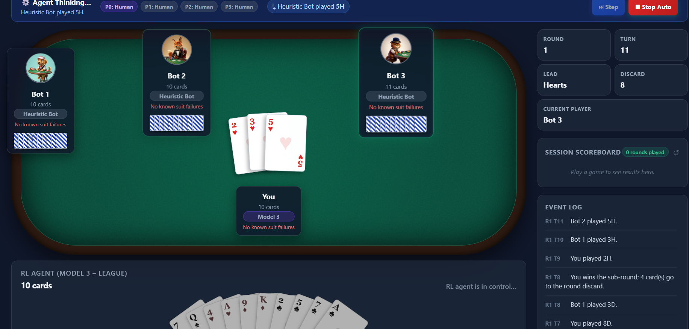
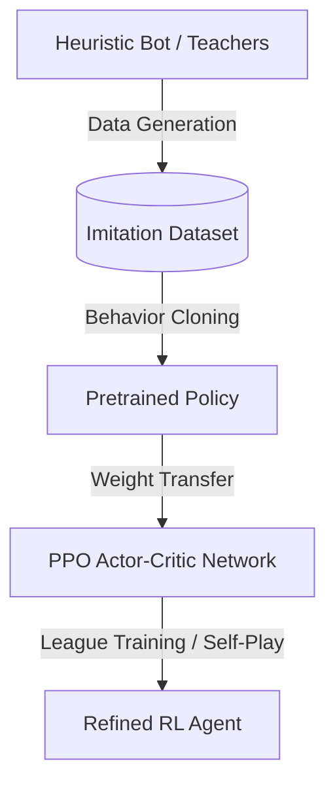

# Laat Card Game: Reinforcement Learning & Simulation Framework

An interactive web-based simulator and Reinforcement Learning (RL) training stack for the **Laat** card game. The project features a Gymnasium environment, a Maskable Proximal Policy Optimization (PPO) agent training pipeline, and a frontend interface for playing the game and watching RL agents compete in real-time.



---

## 🎮 What is Laat?

Laat is a hidden-information card game played with a standard 52-card deck. The objective is simple: **end the game with the absolute fewest cards**.

### Core Mechanics

1. **Lead Suit Enforcement**: If a suit is led, players must follow suit if they have it.
2. **Laat Activation**: If a player cannot follow suit, they can play _any_ card from their hand (a "laat" event).
3. **Trick Resolution**:
   - If a **laat** event occurred, the player who played the highest card of the _lead suit_ collects the entire trick (including the laat card) into their hand.
   - If no **laat** occurred (clean trick), all played cards are sent to the discard pile.
4. **Round Progression**: A round ends when one or zero players have cards remaining. The remaining cards are carried over, the discard pile is reshuffled, new cards are dealt, and a new round begins.
5. **Game Over**: The game concludes when any player's hand exceeds a threshold (typically 52 cards) or the maximum rounds are reached.

---

## 🚀 Quick Start

### 1. Python RL Backend Setup

This project uses [uv](https://github.com/astral-sh/uv) for fast, reliable python package management.

```bash
# Install dependencies and setup virtual environment
uv sync

# Run the API server for Svelte to communicate with models
uv run uvicorn rl.server.agent_api:app --port 8001
```

### 2. Frontend Svelte App Setup

In another terminal, configure and run the frontend server:

```bash
# Install Node packages
npm install

# Start Vite developer server
npm run dev
```

Open [http://localhost:5173](http://localhost:5173) in your browser to play the game!

---

## 🤖 Reinforcement Learning Training Pipeline

Training a highly strategic Laat agent requires transitioning from supervised learning (Behavior Cloning) to Proximal Policy Optimization (PPO) under a multi-agent league framework.



### Step 1: Generate Synthetic Teacher Data

Gather decision state frames by mixing heuristic bot rules and earlier model versions:

```bash
uv run python -m rl.scripts.generate_imitation_data \
  --decisions 400000 \
  --teacher-checkpoint models/model3_ppo/checkpoints/laat_800000_steps.zip \
  --output data/model4/imitation_400k.npz \
  --opponent-pool league \
  --device cuda
```

### Step 2: Behavior Cloning Pretraining (Supervised)

Train the policy weights on the generated teacher datasets to quickly master basic rules:

```bash
uv run python -m rl.scripts.train_behavior_clone \
  --data data/model4/imitation_400k.npz \
  --model-dir models/model4_bc \
  --epochs 20 \
  --device cuda
```

### Step 3: Reinforcement Learning (PPO Fine-Tuning)

Fine-tune the pretrained model inside the Gymnasium environment against a randomized league of opponents:

```bash
uv run python -m rl.scripts.train_maskable_ppo \
  --timesteps 1000000 \
  --model-dir models/model4_ppo \
  --init-policy models/model4_bc/best.pt \
  --opponent-pool league \
  --device cuda
```

### Step 4: Evaluate Strategy

Benchmark trained models against each other over a fixed set of test seeds:

```bash
uv run python -m rl.scripts.evaluate_strategy \
  --model model2=models/model2_ppo/latest.zip \
  --model model3=models/model3_ppo/checkpoints/laat_800000_steps.zip \
  --opponent-pool league \
  --episodes 300
```

---

## 📊 Model Performance Benchmarks

Evaluation results over 300 test episodes against League opponents:

| Metric                  | Model 1 (PPO Baseline) | Model 2 (PPO + BC Init) | Model 3 (League PPO) | Model 4 (Max-Win PPO) |
| ----------------------- | :--------------------: | :---------------------: | :------------------: | :-------------------: |
| **Win Rate**            |         54.0%          |          85.7%          |      **90.3%**       |         89.0%         |
| **Loss Rate**           |         32.0%          |          14.3%          |       **9.7%**       |         10.7%         |
| **Avg Final Hand**      |      14.12 cards       |       5.68 cards        |    **4.45 cards**    |      4.78 cards       |
| **Laat High-Card Rate** |         48.5%          |        **77.2%**        |        68.0%         |         72.3%         |
| **Invalid Actions**     |           0            |            0            |          0           |           0           |
